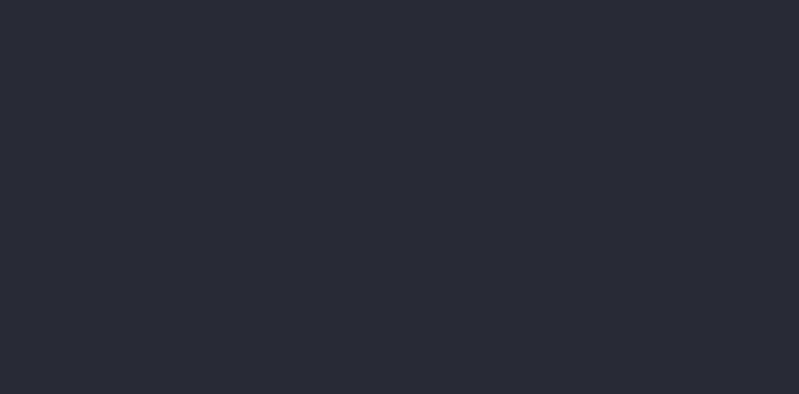

<div align="center">


<br/>


</div>

---

## 🟪 ¿Qué es RecoveryWorld?

**RecoveryWorld** es un clon simplificado de [VHS](https://github.com/charmbracelet/vhs), escrito en
Python puro. Le das un script `.tape` con instrucciones tipo "escribí esto", "esperá tanto",
"apretá Enter" — y te devuelve un **GIF (o MP4/WebM)** grabando una terminal real actuando ese guion,
tipeo incluido.

No depende de navegadores headless ni de Go: abre un **pty real**, corre tu shell adentro, interpreta
la salida con un emulador ANSI hecho a mano, y renderiza cada frame con Pillow.

<div align="center">



</div>

> 💡 El GIF de arriba (`demo.gif`) fue generado corriendo `demo.tape` — no es un mockup, es el output real del script.

---

## ✨ Features

| | |
|---|---|
| 📼 **Scripting tipo VHS** | `Output`, `Set`, `Type`, `Enter`, `Sleep`, `Ctrl+X`, `Screenshot`, flechas, `Tab`, `Backspace` |
| 🖥️ **pty real** | Corre tu shell de verdad (`bash`, `zsh`, `fish`...), no un simulacro |
| 🎨 **Emulador ANSI propio** | Colores SGR, movimiento de cursor, scroll, erase — sin depender de `pyte` ni librerías de terminal |
| 🌈 **Temas incluidos** | `Default`, `Dracula`, `Monokai`, `SolarizedDark` |
| 🎞️ **Export flexible** | `.gif` nativo con Pillow; `.mp4` / `.webm` vía `ffmpeg` si está instalado (si no, cae a GIF automáticamente) |
| ⌨️ **Tipeo animado** | `TypingSpeed` configurable, letra por letra, como una persona escribiendo de verdad |

---

## 📦 Instalación

```bash
pip install pillow
# opcional, para exportar a mp4/webm:
# sudo apt install ffmpeg
```

Sólo Linux/macOS (usa `pty` de la stdlib). En Windows, corré esto desde WSL.

## 🚀 Uso

```bash
python3 recoveryworld.py demo.tape
```

### Ejemplo de `.tape`

```tape
Output demo.gif
Set Shell "bash"
Set FontSize 18
Set Width 1000
Set Height 500
Set Theme "Dracula"
Set TypingSpeed 40ms
Set Framerate 12

Type "echo Hola RecoveryWorld"
Enter
Sleep 1s
Type "ls -la"
Enter
Sleep 1.5s
```

### Comandos soportados

| Comando | Qué hace |
|---|---|
| `Output <archivo>` | Ruta de salida (`.gif`, `.mp4`, `.webm`) |
| `Set <Clave> <Valor>` | `Shell`, `FontSize`, `Width`, `Height`, `Theme`, `TypingSpeed`, `Framerate` |
| `Type "texto"` | Escribe el texto letra por letra |
| `Enter` / `Space` / `Tab` / `Backspace` | Teclas especiales (aceptan un número opcional de repeticiones) |
| `Up` / `Down` / `Left` / `Right` | Flechas del teclado |
| `Ctrl+<letra>` | Combinación de control, ej. `Ctrl+C` |
| `Sleep <duración>` | Pausa, ej. `1s`, `500ms` |
| `Screenshot <archivo.png>` | Captura un frame puntual como imagen |

---

## ⚠️ Limitaciones

RecoveryWorld usa un emulador de terminal ANSI **mínimo, escrito a mano** (no `pyte` ni un xterm
completo), así que:

- Cubre bien lo típico: `bash`, `ls`, `echo`, prompts con color, `git status`, etc.
- Cosas más exóticas (256 colores exactos, unicode de ancho doble, soporte de mouse) pueden no
  verse perfectas.
- El "bold" se simula dibujando el texto dos veces desplazado, porque la fuente por defecto
  (DejaVu Sans Mono) no trae una variante bold embebida.

---

## 🗺️ Roadmap

- [ ] Comandos `Hide` / `Show` (ocultar el cursor durante ciertos tramos)
- [ ] `Set Padding` y `Set CursorBlink`
- [ ] Soporte de fuentes bold reales (pasar una ruta de `-Bold.ttf`)
- [ ] Modo "grabar sesión interactiva" (grabar lo que vos tipeás en vivo, no solo un script)

---

## 🤝 Contribuir

PRs bienvenidos. Si encontrás un caso donde el render ANSI se rompe, un `.tape` de ejemplo que lo
reproduzca ayuda muchísimo a arreglarlo.

## 📄 Licencia

MIT — usalo, rompelo, mejoralo.

<div align="center">


</div>
